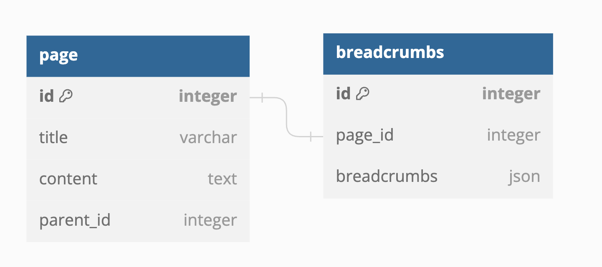

# Notion Page API 구현

[실행 순서](#실행-순서) | [ERD](#ERD) | [구현내용](#구현-내용) | [팀 일정 이력](#팀-일정-이력) | [회고](#회고)

## 실행 순서

0. Dependency - Python 3.11^
1. 레파지토리를 클론받는다.
2. `.env` 파일을 작성한다.
```text
# 예시
# ------------
DB_HOST=localhost
DB_PORT=3306
DB_USER=root
DB_PASSWORD=password
DB_NAME=notionapi
```
3. 프로젝트를 실행한다.
```commandline
# mac 기준
# ------------
python3 -m venv venv
source ./venv/bin/activate
pip3 install -r requirements.txt
python3 main.py
```
4. 원하는 페이지 ID를 입력한다.
   - 단, 현재 코드로는 1부터 10까지 더미데이터가 존재하고 더 이상 추가하려면 `settings.py`에서 변경할 수 있다.
   - 존재하지 않은 ID를 입력시 Error 404가 출력되며 프로그램이 종료된다.
```text
# 출력 예시
# ------------
페이지 ID: 5
{'breadcrumbs': [{'id': 7, 'title': 'page 7'},
                 {'id': 1, 'title': 'page 1'},
                 {'id': 3, 'title': 'page 3'},
                 {'id': 5, 'title': 'page 5'}],
 'content': 'content',
 'id': 5,
 'sub_pages': [],
 'title': 'page 5'}
페이지 ID: 6
{'breadcrumbs': [{'id': 7, 'title': 'page 7'},
                 {'id': 1, 'title': 'page 1'},
                 {'id': 6, 'title': 'page 6'}],
 'content': 'content',
 'id': 6,
 'sub_pages': [],
 'title': 'page 6'}
페이지 ID: 33
Error 404
```

<br/>

## ERD



<br/>

## 구현 내용

- 더미 데이터 세팅
- 페이지 조회
  - 기본/하위 페이지 조회
  - 브레드크럼스 로직 구현 및 추가

### 기본/하위 페이지 조회
 
하위 페이지는 parent_id가 현재 페이지 ID인 데이터를 SELECT 검색하여 추가합니다.
따로 하위 페이지를 관리하는 것 보다 외래키를 걸어 index 처리된 데이터를 한번에 SELECT 하여 시간효율적으로 조회합니다.

### 브레드크럼스 로직 구현

#### 구현 사항 요약

1. 조회 시, 해당 페이지의 부모 페이지를 찾으며 최상위 페이지까지 SELECT 문을 통해 브레드크럼스를 찾아내기.
   - 하지만 뎁스가 깊은 페이지일 경우, 조회 부하가 너무 컸다.
2. 저장 시, 각 페이지의 부모 페이지의 브레드크럼스에 현재 페이지를 더하여 브레드 크럼스 저장 (DP)
   - 조회 부하를 없앴지만, 페이지 순서 변경 시에 하위 페이지의 브레드크럼스 순서를 보장할 수 없었다.
3. 페이지 순서 변경 시, 모든 하위 페이지의 브레드크럼스를 순서에 맞게 업데이트 (BFS)
   - 이로써 효율적인 브레드크럼스 로직을 완성하였다.

#### 구현 내용

처음엔 직관적으로 부모 페이지를 순차적으로 찾아 최상위 페이지까지 도달하는 방식을 통해 브레드크럼스를 구현하였습니다.
하지만 해당 방식엔 문제점이 있었는데, 조회 시에 부모 페이지를 최상위 페이지까지 모두 조회해야 한다는 점이었습니다.
페이지 뎁스가 몇 안되는 작은 서비스면 상관이 없었지만 이번에 구현하는 API의 경우 뎁스 제한이 없었기에 이 방식은 효율적이지 않다고 생각하였습니다.

그렇다면 '캐싱하는 방식을 선택하면 어떨까?'에 대해 고민하다가 다이나믹 프로그래밍(메모이제이션) 방식을 쓰게 되었습니다.
이미 부모의 브레드크럼스를 안다면 최상위페이지까지 또 조회할 필요가 없었기 때문입니다.
그렇게 각 페이지의 브레드크럼스를 저장해놓았고 그것을 SELECT문으로 출력하면 되었습니다.

하지만 이 방법도 문제가 있었습니다. 페이지의 뎁스 순서가 변경된다면 이를 업데이트할 방법이 없었기 때문입니다.
페이지 뎁스 순서 변경이라는 이벤트는 조회에 비해 거의 일어나지 않는 이벤트이지만 필수적으로 고려해야 했습니다.
그렇다면 하위 페이지 전체를 BFS로 돌며 상위 페이지의 브레드크럼스에 자기자신을 더하여 저장해놓는다면 어떨까라는 생각을 했고
그렇게 구현한 코드는 브레드크럼스 로직을 효율적으로 잘 동작하게 만들어 주었습니다.

#### 그 외 생각해 본 것들

1. SELECT 쿼리가 많이 나간다면?
   - fetch size 조정을 통해 네트워크 비용을 아껴서 효율적으로 만든다.
   - 현재 페이지의 뎁스를 저장하여 해당 뎁스만큼 지정된 수로 JOIN 쿼리를 통해 데이터를 불러낸다.(이 방식 또한 부하가 큼)
2. 캐싱
   - 브레드크럼스 자체를 Redis에 저장해둔다. 각 페이지가 변경될 때, 해당 페이지와 하위 페이지의 TTL을 0으로 변경(캐시무효화)시킨다.

<br/>

## 팀 일정 이력

1. 23.09.01(금) - 모든 팀원이 같이 만날 수 있도록 일정 조율 
2. 23.09.03(일) - 아이디어 공유 
   - 그 동안 생각해놓은 아이디어를 공유하는 시간
3. 23.09.03(일) - 아이디어, 벤치마킹 자료 서칭
   - 팀끼리 생각했던 내용보다 더 좋은 아이디어가 있는지
   - 실제 Notion API는 어떻게 이용되는지
   - Neo4j 같은 트리구조의 데이터베이스 이용은 어떤지
4. 23.09.03(일) ~ 23.09.04(월) - 각자 코드 작성 후 코드리뷰 요청
   - 아이디어를 공유 및 서칭 후, 서로 생각했던 각자의 코드로 구현하는 시간
5. 23.09.04(월) - 서로의 코드 로직 발표
   - 그 중 하나의 코드를 선정 후, 해당 코드 리팩토링 및 개선

<br/>

## 회고

- [강석영 📝](./reviews/Kang.md)
- [구태완 📝](./reviews/Gu.md)
- [사재혁 📝](./reviews/Sa.md)
- [손진효 📝](./reviews/Son.md)
- [양금성 📝](./reviews/Yang.md)
